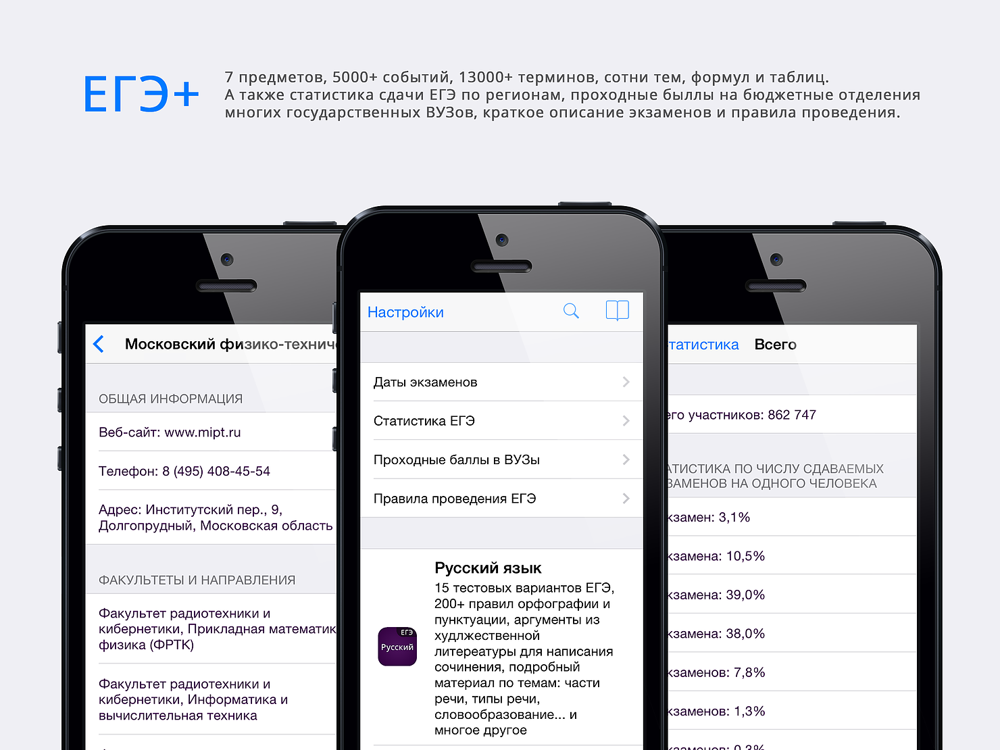
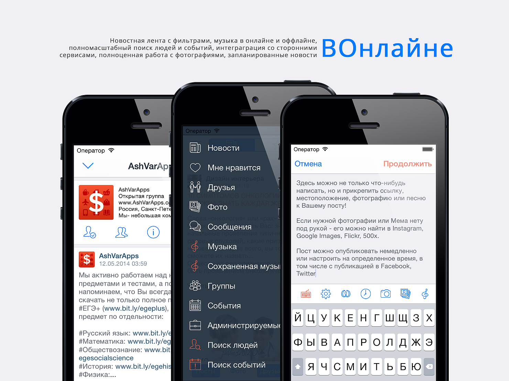

Since 2015 I am working on Artificial Intelligence and High-Performance Computing (HPC).
Before that, however, I was doing something far more straightforward.
Here is what my path in IT looked like:
- web & graphical design,
- web development,
- **mobile development**,
- scientific computing,
- AI + HPC.
I have built over 30 mobile apps throughout the years. Many of them failed, but some were successful, so I decided to share the stories behind three of my favourite projects.

### Ed-Tech

Let's jump back to the year 2009.
 
I have saved some money from my previous ventures and bought my first MacBook Pro. It was my first personal computer, and I wanted to extract maximum value from that purchase, so I immediately started prototyping iOS apps! As I was transitioning into high school, I decided to build apps that would help me study better and prepare for exams.
 
A little later, the project grew from a single **EGE** app into a chain of apps, matching each subject we had in school. I combined thousands of sample tests & educational materials, so the value proposition was quite good, and kids all around the country started using my apps. I even saw kids using my apps on public transport in my home city!

### Productivity Apps

I was happy with my first results but wanted to build a new business - something global!
 
I took the most annoying thing you could do on your phone and tried to improve it! I've built an expenses-tracking app with (until now) unbeaten functionality, but adjustable and straightforward interface - **Expenses**. I have invested a lot of time and money into development, so I translated it into seven languages to make it usable in many markets. Sales started just great, but trying to extend app functionality beyond standards came at a cost. 
 
One of the significant issues back then was data synchronization. Nowadays, one can offload the intricate work of keeping the data synced to various public APIs built specifically for that purpose. But none of them existed back then. So you had two options:
- Build a server app yourself and store all of the users' data on your cloud, 
- Use iCloud, DropBox or Google Drive for that, which were not mature at that time. 
The first option required users to store private data on an untrusted server, managed by a teenager. Long story short, I decided to rely on large companies. A few updates later, syncing with iCloud started failing, and iOS SDK for Google Drive never worked properly in the first place, so I had to shut down the project to reduce the risk of people losing their data.

### Social Apps

**VOnline** was the client app I wrote for the "Vkontakte" social network. At one point I have realized, that the official app doesn't implement a big part of the functionality available in the Web version. So I decided to write my own. What was so special about it?
 
- For every type of data coming from "Vkontakte" servers, I had built caching mechanisms, so even without a proper internet connection, you could watch videos and listen to music saved on the device. You could scroll through posts and messages and also run search & analytics queries on top of it.
- You could filter the posts in your newsfeed by different tags or **automatically hide something offensive content** or **spam**. A feature that would make a lot of sence today, in 2019. Keep in mind that I had no servers and "Vkontake" had no such functionality, all of it was running on an iPhone! That was a long time before companies started putting "Tensor Processing Units" and powerful GPUs into their devices. The devices only had 1-2 cores, and sometimes the operating system would limit your app to only 1 physical thread. As a result, I had to optimize not only the way I analyze & store data but even graphics rendering. That was the moment when I finally transitioned to low-level languages like C++. I once spent 2 months replacing "UITableView" (which is just a scrollable list UI component) with my implementation on top of OpenGL to handle more complicated layouts and larger content volumes.
- Among other things, the app had flexible search options for content, events and people around the network. It had an extra layer of encryption for messages and the ability to manage online communities right from your phone. 
 
Believe it or not, the app was installed just once - on my personal iPhone. I couldn't get approval and submit it to the App Store for one simple reason. By letting users save content for future offline consumption, I was violating the content ownership rights. Until today, I don't understand the difference between watching a video stream and downloading it on to the device. 

### Results

I could have organized those stories in a book-like fashion by adding some advice under each section, but sometimes a story is just a story. Maybe it will inspire you to build something exciting today!